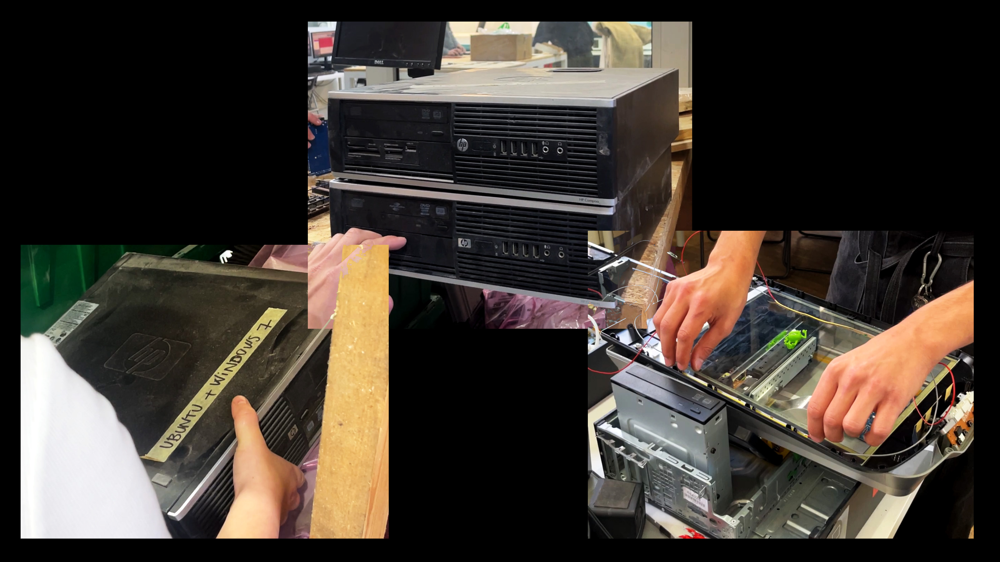
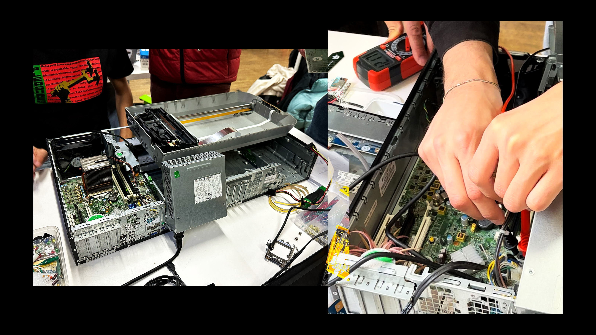
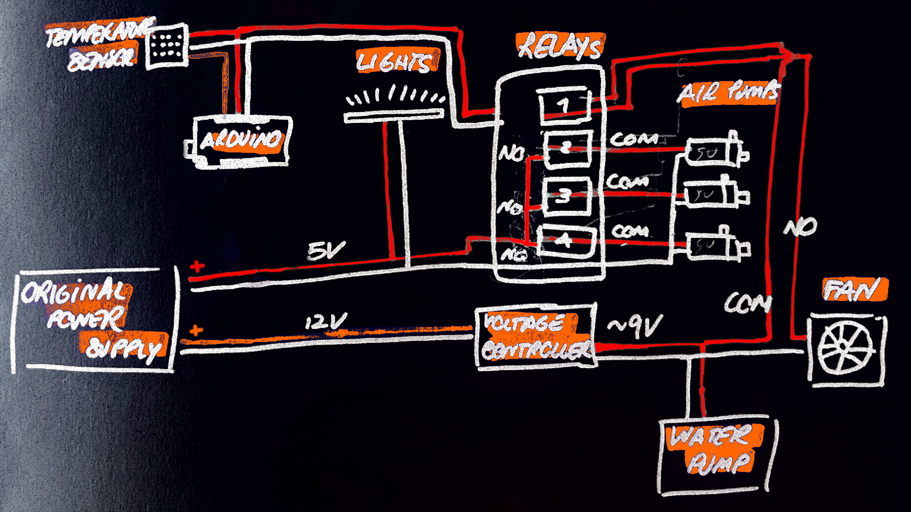
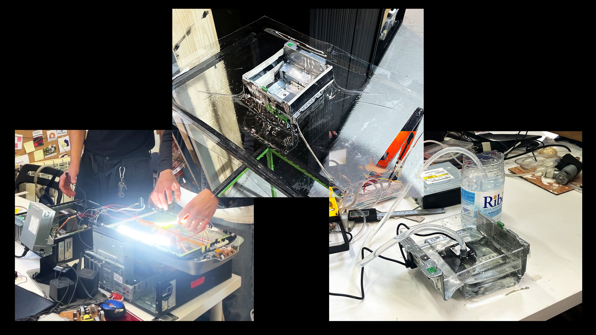
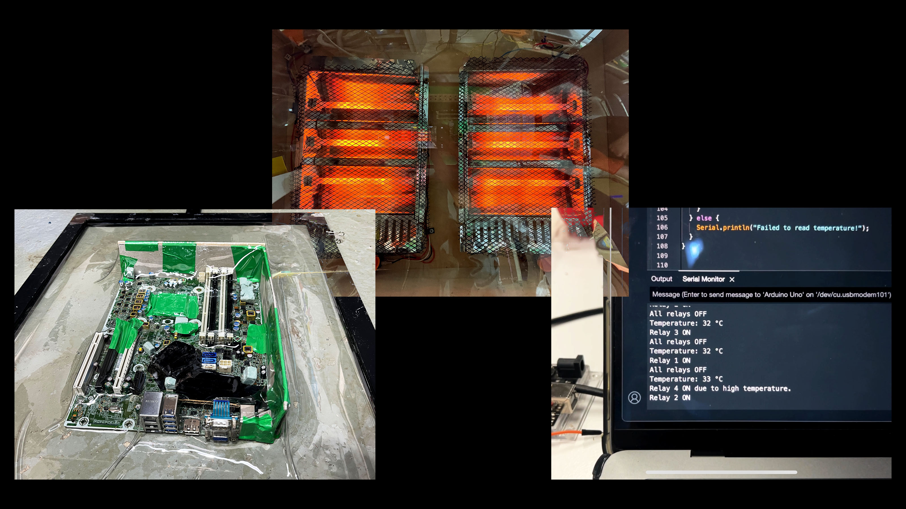
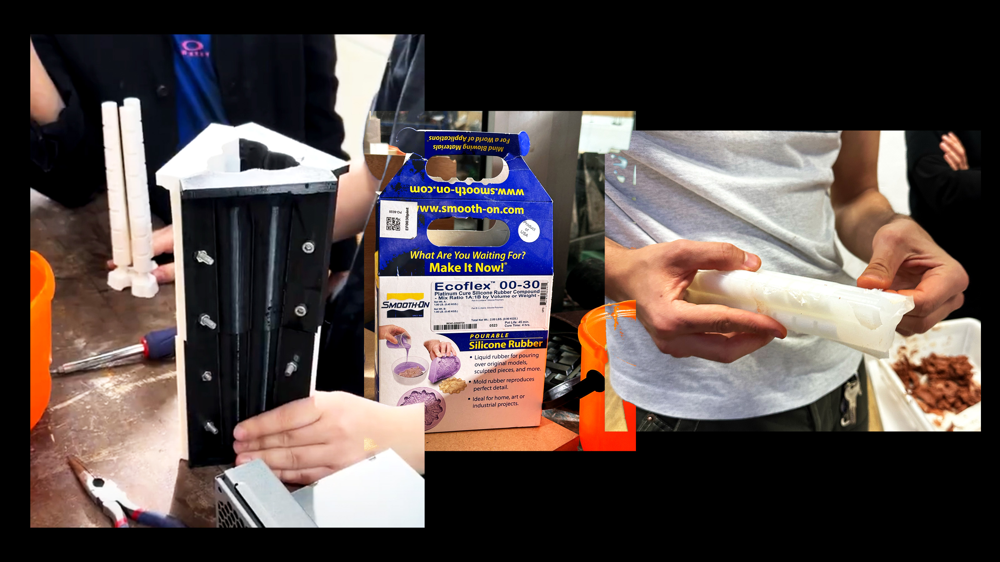
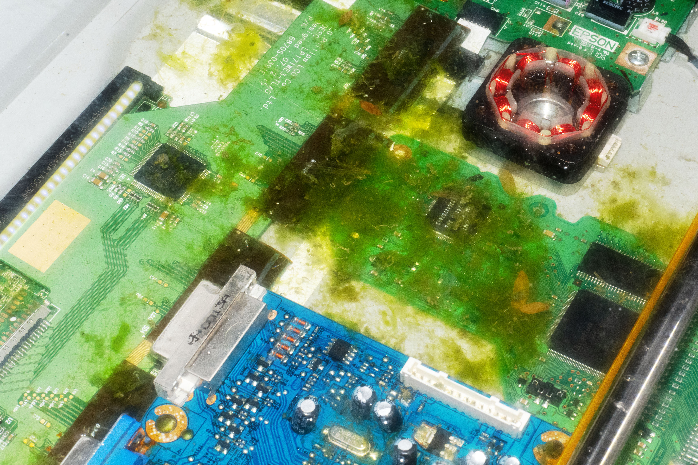
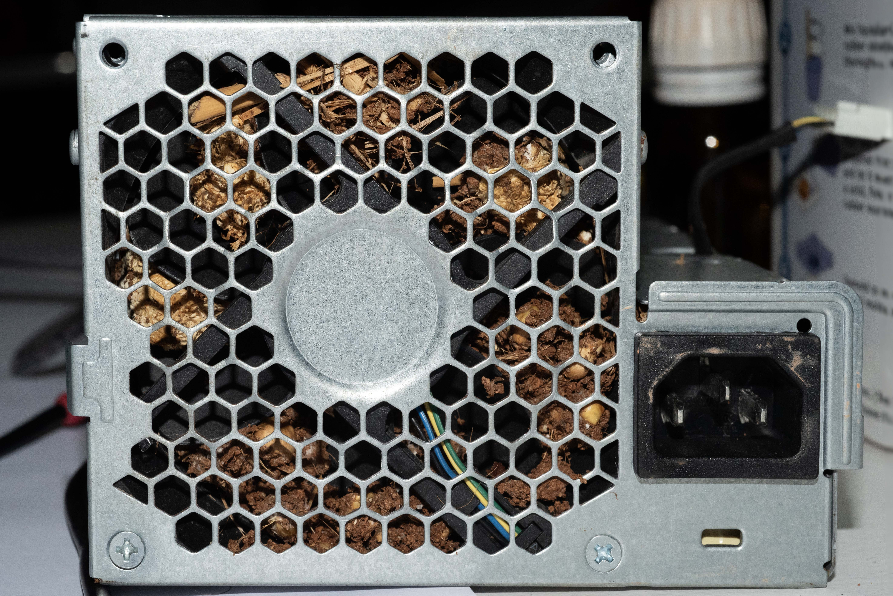

# **GAIA: Symbiotic Relationships in between Computers and Organic Matter**

## **Step 1: Setting Up**

1. **Selecting the Equipment**:

    
    For our project, we used 3 discarded HP COMPAQ 6200 computers, both for structural and functional purposes, and an EPSON PERFECTION 4490 Scanner. These were found in the FabLab archive, deemed too outdated or damaged for further use.
    
2. **Analyzing the Architecture**:

    
    The initial challenge involved assessing the materials we had gathered to efficiently repurpose any still-functioning components. Upon testing all the devices through plugging them in or by using a multimeter, we found out that 2 PCs were completely inoperative, while one managed to show signs of power but failed to boot or load the operating system. Similarly, the scanner was found to be non-functional.
    Closer inspection of the operational PC revealed that the heat diffuser above the CPU was generating significant heat, that the fan was functional and that the motherboard’s power supply ports were outputting 12V and 5V.
    
3. **Define the Project Schematic**:
We then decided to take advantage of this working system to hack it and shape it to our intentions, as you can see from the following workflow schematic:
    

## **Step 2: Hacking**

1. **Scanner & Pool - Seal, Inserting Lights, Vacuum Machine**:
    
    
    Our initial modification involved transforming the scanner to accommodate algae, requiring us to seal leaks with hot glue. With the goal of creating a small fountain from the rear ports (lol), we designed a water circulation system connected to a pool situated where the PC's CD reader once was. Here, the challenge was to construct a water-tight container to prevent any electrical hazards. Using a vacuum machine with a thin layer of transparent plastic, we crafted the container by reinforcing its structure with cardboard. 
    A 12V water pump was installed to circulate water back to the scanner above, which was outfitted with lights to support algae photosynthesis.

    
    
2. **Main Computer - Temperature Control & Electronics Protection**:

    
    We employed the vacuum machine again to wrap the motherboard in a protective plastic layer, paying attention in smoothing any sharp edges to prevent breaking the material. 
    We then set the temperature control: in fact, if the system overheats without any fan connected. 
    This was managed by using an Arduino UNO and a DHT11 Temperature Sensor, in order to activate the PC's original fan only if detecting temperatures above a predefined threshold and keeping it balanced.
    
3. **Soft Robot - Setting Pumps, Relays, Sensors**:

    
    Our soft robot was inspired by [a design found on Hackster.io](https://www.hackster.io/blight3d/gesture-controlled-soft-robot-tentacle-0b9f68). Following this model, we 3D printed the molds and experimented with various silicones to achieve the desired flexibility. The best results were obtained by mixing ecoflex 00-30 with a firmer silicone, which prevented the structure from collapsing. 
    If any holes appear in the process, we suggest to use a fast-drying silicone on the holes by keeping the inner structure of the mold inside. 
    The electronics and code were then adjusted to activate each of the three relays and pumps based on the readings from their respective ultrasonic sensors.
    
4. **Cable Mangaement:**
    The final step involved doing some wiring optimization to give the project a more organic and less cluttered appearance. 
    Also the Arduino has been connected to one of the original USB ports of the computer, and a voltage regulator (12V→8V) has been used to calibrate the water flow of the fountain.

## **Step 3: Life**

1. **Introducing Algae**:
    
    
    We sourced local algae from a nearby pond to inhabit the scanner, introducing e-waste into the pool to observe if the algae would colonize it.
2. **Cultivating Mycelium**:
    
    
    The transformer from one of the inoperative PCs was repurposed as a growth chamber for Lion’s Mane mycelium, chosen for its optimal living temperature of around 25°C. This setup was placed near the CPU’s heat diffuser to maintain and monitor the ideal temperature for mycelium cultivation.
3. **Establishing a Soil & Plant Garden**:
    
    
    We gutted the interior of the other broken PC and sealed any openings with heated plastic. This conversion allowed us to create a container for our hybrid garden. After adding soil and hiding the base of the soft robot in it, we introduced various plants to complete the garden.
